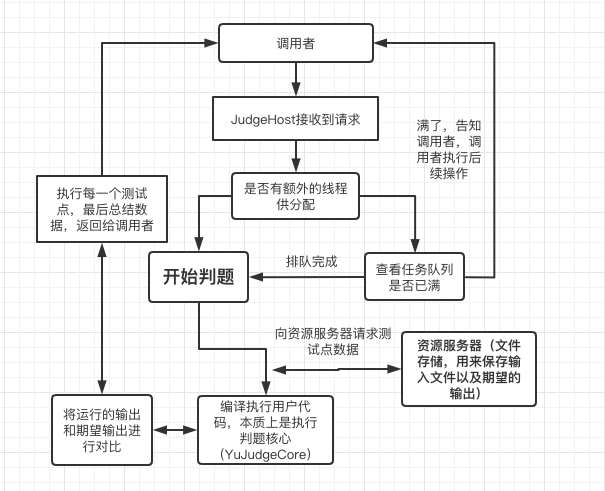

# YuJudge-JudgeHost

这是YuJudge项目的**判题服务器**，基于java的springboot框架。

## 它是如何工作的？



## 最佳实践（线程池 + 集群）

事实上，不像一般的增删改查项目，对于**OnlineJudge**这种**CPU密集型**项目，有时**几十个并发的请求**就会将服务器压垮，我们需要**合理调度**。

假如在**一小段时间内出现了较多的并发请求（几十个人同时提交）**，服务器可能会**不堪重负**。

于是，本项目采用了**线程池**管理了判题线程，OnlineJudge这种**判题类**的项目属于**CPU密集型**。建议您使用**测试工具**（如**jmeter**）进行压力测试，以根据您的**服务器配置**选择合适的配置。

您应该考虑以下内容来**合理调整**线程池的相关配置(例如请求队列的长度)：

- **用户容忍的等待时间**，有时一道题目的判题时间会很长。（可能是代码执行时间长，或者排队时间长）
- **判题任务执行的平均时长**

我们需要**控制并发量**，并对多余的请求使用**队列**排队，对于**队列已满**的请求，JudgeHost会将其**驳回**：

```json
{
    "code": "B1005",
    "message": "判题服务器负载已满",
    "request": "POST /judge/run"
}
```

对于此类情形，我们应该集群部署，通过**多台计算机完成同一个工作**，达到更高的效率。

此时，调用者应该**请求另一台机器**（如果有的话），或者放弃**本次请求**（例如向前端返回【服务器正忙】的消息）。


## 项目结构


```
YuJudge-JudgeHost                                          
├─ .gitignore                                                      
├─ Dockerfile                                                      // dockerfile配置
├─ README.md                                                       // 项目自述文件
├─ build.sh                                                        // 安装脚本
├─ help                                                            
│  └─ work.png                                                     
├─ mvnw                                                            
├─ mvnw.cmd                                                        
├─ pom.xml                                                         // pom配置
└─ src                                                             
   ├─ main                                                         
   │  ├─ java                                                      
   │  │  └─ com                                                    
   │  │     └─ yzl                                                 
   │  │        └─ judgehost                                        
   │  │           ├─ JudgeHostApplication.java                     // 应用入口
   │  │           ├─ api                                           // Controller层
   │  │           │  └─ v1                                         
   │  │           │     ├─ AuthorizationController.java            // 身份验证相关接口
   │  │           │     ├─ FileController.java                     // 文件处理相关接口
   │  │           │     └─ JudgeController.java                    // 判题接口
   │  │           ├─ core                                          // 项目核心
   │  │           │  ├─ authorization                              // 权限管理相关
   │  │           │  │  ├─ AuthorizationInterceptor.java           
   │  │           │  │  └─ AuthorizationRequired.java              
   │  │           │  ├─ common                                     // 一般内容
   │  │           │  │  ├─ DocumentResponse.java                   
   │  │           │  │  ├─ JudgeThreadFactory.java                 // 判题线程池工厂
   │  │           │  │  └─ UnifiedResponse.java                    // http统一返回
   │  │           │  ├─ configuration                              // 相关配置
   │  │           │  │  ├─ AuthorizationConfiguration.java         // 权限配置
   │  │           │  │  ├─ ExceptionCodeConfiguration.java         // 异常配置
   │  │           │  │  ├─ JudgeEnvironmentConfiguration.java      // 判题环境配置
   │  │           │  │  └─ JudgeExecutorConfiguration.java         // 线程池配置
   │  │           │  ├─ enumerations                               // 枚举类
   │  │           │  │  ├─ JudgeConfigDefaultEnum.java             // 判题配置
   │  │           │  │  ├─ JudgePreferenceEnum.java                // 判题偏好
   │  │           │  │  ├─ JudgeResultEnum.java                    // 判题结果
   │  │           │  │  └─ LanguageScriptEnum.java                 // 判题语言
   │  │           │  └─ handlers                                   
   │  │           │     ├─ GlobalExceptionHandler.java             // 全局异常处理
   │  │           │     └─ HttpRequestHandler.java                 // http请求处理
   │  │           ├─ dto                                           // 数据传输对象
   │  │           │  ├─ AccessTokenDTO.java                        
   │  │           │  ├─ AuthorizationDTO.java                      
   │  │           │  ├─ JudgeDTO.java                              
   │  │           │  ├─ ResolutionDTO.java                         
   │  │           │  └─ SingleJudgeResultDTO.java                  
   │  │           ├─ exception                                     // 异常相关
   │  │           │  └─ http                                       // http异常相关
   │  │           │     ├─ ForbiddenException.java                 
   │  │           │     ├─ HttpException.java                      
   │  │           │     └─ NotFoundException.java                  
   │  │           ├─ network                                       // 网络请求相关
   │  │           │  └─ HttpRequest.java                           
   │  │           ├─ scripts                                       // 依赖的脚本
   │  │           │  ├─ compare.sh                                 
   │  │           │  ├─ compile.sh                                 
   │  │           ├─ service                                       // Service层
   │  │           │  ├─ AuthorizationService.java                
   │  │           │  ├─ FileService.java                          
   │  │           │  └─ JudgeService.java                        
   │  │           ├─ utils                                         // 工具类
   │  │           │  ├─ DataReformat.java                          
   │  │           │  ├─ FileHelper.java                           
   │  │           │  ├─ TokenHelper.java                         
   │  │           │  └─ YamlPropertySourceFactory.java            
   │  │           ├─ validators                                    // 验证器
   │  │           │  ├─ LanguageTypeAccepted.java                
   │  │           │  ├─ LanguageTypeAcceptedValidator.java        
   │  │           │  ├─ LoginValidated.java                       
   │  │           │  └─ LoginValidator.java                      
   │  │           └─ vo                                            // 表现层对象
   │  │              ├─ AuthorizationVO.java                       
   │  │              └─ JudgeConditionVO.java                      
   │  └─ resources                                                 // 项目配置文件
   │     ├─ application.yml                                        // 总配置
   │     └─ config                                                 
   │        ├─ application-dev.yml                                 // 开发环境配置
   │        ├─ application-prod.yml                                // 生产环境配置
   │        ├─ exception-codes.yml                                 // 错误码配置
   │        └─ judge-environment.yml                               // 判题环境配置
   └─ test                                                         // 测试相关，包含jmeter的配置文件
```
